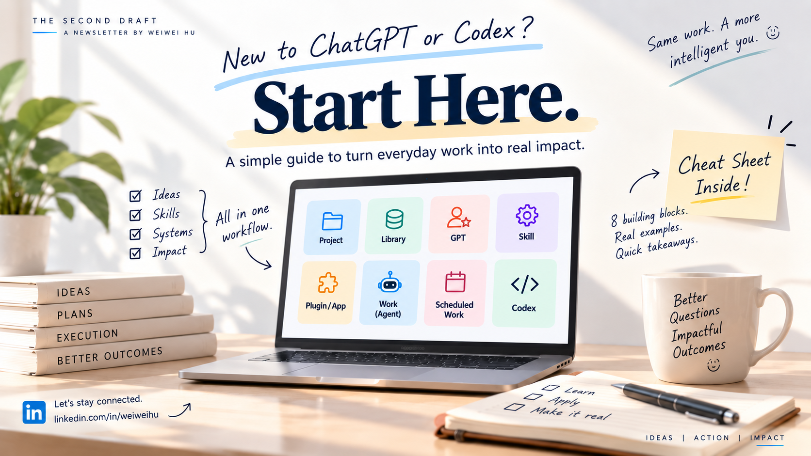
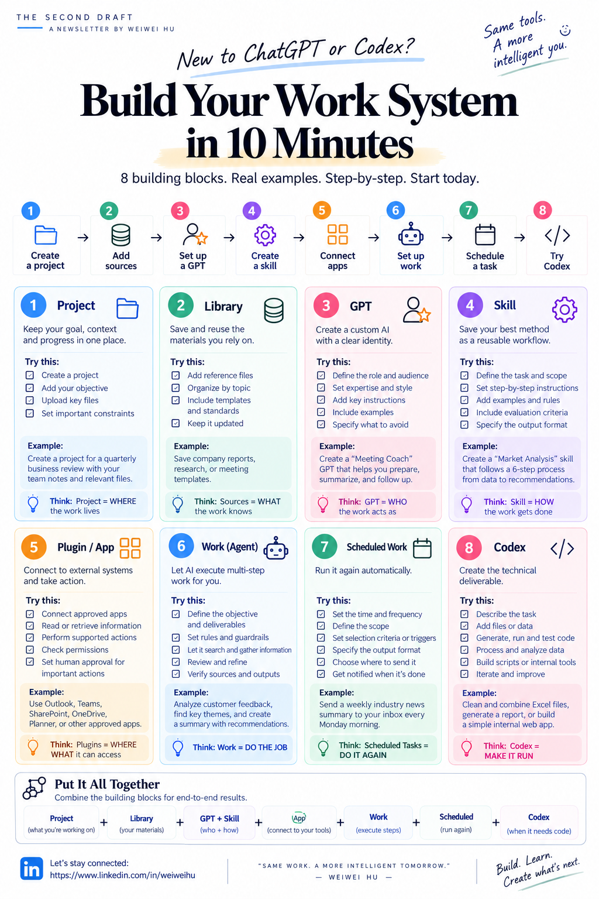

# ChatGPT Enterprise & Codex at Work: What to Use and How to Start

**A practical guide to choosing your first task, reviewing the result, and making recurring work easier, with a cheat sheet and GitHub starter kit.**

As ChatGPT Enterprise and Codex licenses begin reaching more employees, I keep hearing two questions:

**Where should I start?**  
**What should I actually use this for?**

I am learning alongside everyone else. My recommendation is simple: begin with work you already understand well enough to judge. Define the result you need, complete one attempt, review it carefully, and preserve only the parts that prove useful.

Most people need a first useful result more than another product tour.

> **A license gives you access. A useful result gives you a reason to come back.**

## The cheat sheet

The one-page guide below explains the eight building blocks, what each one does, and how they can work together. Keep it open as a reference while you test your first real task.

[Open or download the full-size cheat sheet](assets/chatgpt-work-system-cheatsheet.png)

**Terminology note:** The visual uses two short labels. “Work (Agent)” refers to **ChatGPT Work**, and “Scheduled Work” refers to **Scheduled tasks** in the current product documentation.

## Start with work you can judge

Your first task should be frequent, bounded, supported by known sources, quick to review, and useful for a decision or action.

Good candidates include preparing for a meeting, drafting a weekly leadership update, comparing proposals, summarizing customer feedback, or consolidating recurring files. I would save broad strategy questions, sensitive people decisions, and unsupervised external actions for later.

Starting with familiar work gives you an advantage: you can recognize missing evidence, weak reasoning, and generic recommendations.

> **Start where your judgment is strongest.**

## Choose by the result you need

Before exploring every feature, decide what result you want.

Use **Chat** for thinking, drafting, summarizing, and feedback. Use **ChatGPT Work** when the assignment requires several connected steps and a finished, reviewable business deliverable. Use **Codex** when the result requires code, scripts, testing, repositories, file processing, or another technical implementation.

Choose based on whether you need a conversation, a finished deliverable, or executable technical work.

## Let one task earn the next capability

Imagine a weekly leadership update.

The first Friday, use Chat to produce one draft from your notes. The second Friday, add a Project and Library when you realize you are repeating the background and finding the same materials. The third Friday, capture the stable role in a GPT and the repeatable procedure in a Skill. The fourth Friday, connect approved Apps and use ChatGPT Work when gathering and synthesizing information becomes the slowest part.

After several reviewed runs, schedule the process. Bring in Codex only when the update needs scripts, data processing, automated checks, or an internal tool.

> **Let the task earn the next tool.**

## Define the finish line before you ask

Many weak outputs begin with a request that never defines “done.” For serious work, specify five things:

1. Who will use the result?
2. What decision or action should it support?
3. Which sources should support it?
4. What exact deliverable and length are required?
5. What should pause for human judgment or approval?

[Use the first-task prompt](Practical%20Guide.md#prompt-1-first-useful-task) to define these before you begin.

> **A better result usually starts with a better definition of done.**

## Measure the first useful result

Time saved is useful, although it is only one part of the evidence. I would also track how much human revision was required, whether the necessary sources were covered, and whether the output helped someone decide or act.

The question I would ask is simple:

> **Did the tool merely produce text, or did it help someone make a better decision with less effort?**

## Earn more autonomy one reviewed run at a time

Begin with assistance: drafting, summarizing, or critique. Move to execution when the process and sources are understood. Allow actions in connected systems only after permissions, review points, and consequences are defined.

> **Review first. Repeat second. Automate third.**

## Your first 30 minutes

Pick one task you will perform again within the next two weeks. Define the audience, decision, sources, deliverable, and review point. Choose Chat, ChatGPT Work, or Codex based on the result. Complete one attempt, review it, and identify the single repeated step that deserves to be preserved next.

You do not need to master every capability this week. One reviewed task is enough to begin.

I hope the attached cheat sheet and GitHub starter kit give you a practical place to start. I would love to hear what you try first, what works, and where you get stuck.

**Which recurring task do you understand well enough to judge and need to do again soon?**

---

## Companion resources

- [Complete practical starter guide](Practical%20Guide.md)
- [Microsoft Copilot and ChatGPT Enterprise comparison](Microsoft%20Copilot%20and%20ChatGPT%20Enterprise.md)
- [Reusable weekly leadership-update Skill](skills/weekly-leadership-update/SKILL.md)
- [Official sources](SOURCES.md)

Created by **Weiwei Hu**  
[LinkedIn: linkedin.com/in/weiweihu](https://www.linkedin.com/in/weiweihu)

_Product availability and controls can vary by plan, workspace permissions, administrator settings, device, region, and rollout. Follow your organization’s policies._
