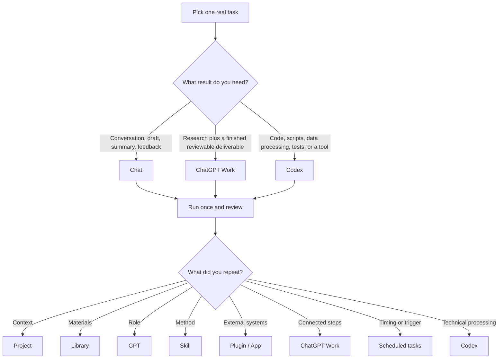

# ChatGPT Enterprise & Codex Practical Guide

This guide consolidates the first-use exercise, decision guide, prompts, examples, measurement approach, and governance checks for employees getting access to ChatGPT Enterprise or Codex.

If your organization also provides Microsoft Copilot, use the [Microsoft Copilot and ChatGPT Enterprise comparison](Microsoft%20Copilot%20and%20ChatGPT%20Enterprise.md) to choose a starting tool and define any approved handoff between them.

## The core sequence

> **Pick one real task → define “done” → choose Chat, ChatGPT Work, or Codex → complete one reviewed run → preserve one repeated part.**

## Your first 30 minutes

### 0–5 minutes: Pick one real task

Choose work you already know how to evaluate:

- Prepare for an upcoming meeting
- Draft a weekly leadership update
- Compare several proposals
- Summarize customer feedback
- Consolidate recurring files
- Create a small script or report

A strong first task is frequent, bounded, supported by known sources, quick to review, and useful for a decision or action. Save broad strategy questions, sensitive people decisions, and unsupervised external actions for later.

### 5–10 minutes: Define “done”

Write down five items:

1. **Audience:** Who will read or use the result?
2. **Decision or action:** What should the result help them decide or do?
3. **Sources:** Which approved materials should support it?
4. **Deliverable:** What format, length, and sections are required?
5. **Review point:** What should pause for human judgment or approval?

### 10–20 minutes: Choose Chat, ChatGPT Work, or Codex

| Need | Start with |
|---|---|
| Conversational help, drafting, summarization, critique, or idea exploration | **Chat** |
| Several connected steps plus a finished, reviewable business deliverable | **ChatGPT Work** |
| Code, scripts, tests, repositories, or repeatable technical processing | **Codex** |

### 20–25 minutes: Review the result

Check:

- Are important facts supported?
- Are the required sources present?
- What is missing, uncertain, or conflicting?
- Is the result useful for the intended audience and decision?
- How much human editing is required?
- Did the process stop before consequential actions?

### 25–30 minutes: Decide what to preserve

| Repeated effort | Add next |
|---|---|
| Background and prior conversations | **Project** |
| Reports, templates, research, standards, and examples | **Library** |
| Expert role, audience, tone, and boundaries | **GPT** |
| Procedure, examples, output format, and quality checks | **Skill** |
| Access to approved systems | **Plugin / App** |
| Multi-step execution | **ChatGPT Work** |
| Timing, recurrence, monitoring, or triggers | **Scheduled tasks** |
| Code, data, or file processing | **Codex** |

Choose one next addition. Every extra layer should remove a known manual step.

---

## Decision guide



### Practical selection table

| Situation | Best first move |
|---|---|
| “I keep explaining the initiative from the beginning.” | Create a **Project**. |
| “I keep looking for the same reports and templates.” | Save and organize them in **Library**, then name the items required for the assignment. |
| “I keep correcting the role, audience, or tone.” | Define a **GPT** after the stable requirements are known. |
| “I keep rewriting the same procedure.” | Create a **Skill** with steps, examples, output requirements, and checks. |
| “The task needs Outlook, Teams, SharePoint, or another approved system.” | Connect the relevant **App** and test a low-risk read or action. |
| “The work requires research, comparison, synthesis, and a finished deliverable.” | Use **ChatGPT Work** with a defined objective and review point. |
| “The process should run weekly, monthly, or after an event.” | Use **Scheduled tasks** after several dependable runs. |
| “The result requires scripts, tests, file processing, or an internal tool.” | Use **Codex** with explicit acceptance criteria. |

### Three operating rules

1. **Start with one useful output.**
2. **Add a capability only when it removes a known manual step.**
3. **Increase autonomy only after reviewed runs.**

---

## One complete example: Weekly leadership update

### First run: Get a useful draft

Use Chat with your notes, priorities, risks, and intended audience. Ask for a concise update containing progress, decisions, risks, owners, and next actions.

### Second run: Preserve context and materials

Create a **Project** for the ongoing update and place the objective, audience, priorities, constraints, and relevant conversations there. Save approved templates, prior updates, definitions, and source material in **Library**.

### Third run: Preserve role and method

Use a **GPT** for the continuing role and standards, such as concise executive communication, evidence-backed statements, early risk disclosure, and explicit decision requests. Use a **Skill** for the repeatable procedure:

1. Review progress against priorities.
2. Separate completed work from active work.
3. Identify risks, blockers, and dependencies.
4. Extract decisions required.
5. List actions, owners, and dates.
6. Verify the supporting evidence.
7. Produce the update in the approved format.

### Fourth run: Connect sources and complete the assignment

Connect approved Apps such as Outlook, Teams, SharePoint, or other configured services when the assignment needs information from those systems. Use ChatGPT Work to gather, filter, compare, analyze, draft, verify, and prepare the result for review.

### Later: Add recurrence or technical execution

Use Scheduled tasks after the manual process produces dependable results. Add Codex when the update requires file consolidation, validation, scripts, automated tables, tests, or an internal reporting utility.

> **Review first. Repeat second. Automate third.**

---

## Define the finish line

Use this checklist before asking for serious work:

| Requirement | Question |
|---|---|
| Audience | Who will use the result? |
| Decision | What should it help them decide or do? |
| Evidence | Which approved sources should support it? |
| Deliverable | What exact format, length, and sections are required? |
| Review | What should pause for human judgment or approval? |

---

## Prompt library

### Prompt 1: First useful task

```text
Help me complete [recurring task] for [audience].

Before starting, ask me for:
1. The objective or decision this should support
2. The required sources
3. Important constraints
4. The expected deliverable and length
5. The review or approval point

Recommend whether I should begin in Chat, ChatGPT Work, or Codex. Start with the simplest useful setup.

After the first result, tell me which parts are likely to repeat and which one capability (Project, Library, GPT, Skill, Plugin/App, ChatGPT Work, Scheduled tasks, or Codex) would make the next run easier.
```

### Prompt 2: Finished ChatGPT Work assignment

```text
Prepare [deliverable] for [audience] to support [decision or action].

Use only [approved sources] and cover [scope or time period].

Complete these steps:
1. Gather the relevant material
2. Remove duplication and unrelated information
3. Compare the evidence against [criteria]
4. Identify major findings, risks, gaps, and open questions
5. Draft the deliverable in [format and length]
6. Distinguish verified facts from interpretation
7. Cite or identify the supporting source for each important claim
8. Run a final quality check

Pause before sending, publishing, modifying external information, or taking any consequential action.
```

### Prompt 3: Codex task

```text
Create [technical deliverable] using [files, repository, or data].

Goal:
[Describe the business result.]

Inputs:
[List the relevant files, folders, tables, or repository paths.]

Rules and constraints:
[List business rules, privacy restrictions, formats, libraries, and anything that must remain unchanged.]

Acceptance criteria:
1. [Expected output]
2. [Validation or reconciliation rule]
3. [Required tests]
4. [Exception handling]
5. [Documentation required]

Before changing anything, inspect the inputs and explain the proposed approach. Then implement it, run the tests, report exceptions, and provide the final files plus instructions for reuse.
```

### Prompt 4: Prepare for a leadership meeting

```text
Prepare a concise meeting brief for [meeting] on [date].

Audience: [attendees]
Decision or outcome needed: [decision]
Sources: [emails, documents, reports, notes]

Produce:
- A five-line executive summary
- The three most important facts
- Decisions already made
- Open risks and dependencies
- Questions I should ask
- Decisions or support I should request
- A follow-up action list with owners and dates

Identify missing or conflicting information. Do not invent details.
```

### Prompt 5: Convert corrections into a reusable method

```text
Review the corrections I made to this output.

Separate them into:
- Stable role or audience requirements
- Repeatable process steps
- Output-format rules
- Quality checks
- Exceptions or approval points

Recommend what belongs in a GPT and what belongs in a Skill. Draft the smallest reusable version of each, without adding requirements I did not provide.
```

---

## Measure the first useful result

Time saved is one signal. Also track:

1. **Time to first useful draft**
2. **Human revision required**
3. **Evidence coverage**
4. **Decision or action enabled**

### Illustrative scorecard

| Measure | Before | After |
|---|---:|---:|
| Time to prepare the update | 90 minutes | 40 minutes |
| Human editing | 30 minutes | 10 minutes |
| Required sources included | 3 of 5 | 5 of 5 |
| Leadership asks surfaced | Buried in text | Two explicit decisions |

These numbers are illustrative. Use your own baseline and record the actual result.

---

## Practical governance checklist

Your company’s policies, approved tools, data classifications, and review requirements take precedence.

### Before using company information

- Confirm that the workspace and product are approved for the data involved.
- Use only the information required for the task.
- Check whether confidential, personal, regulated, legal, HR, security, or customer data requires additional controls.
- Confirm which Apps, plugins, websites, repositories, and storage locations are approved.

### Before connecting an App

- Review requested permissions.
- Apply least-privilege access where available.
- Start with a low-risk read or retrieval action.
- Confirm which actions can write, send, delete, publish, or alter external information.
- Identify who can authorize organization-wide Microsoft permissions when required.

### Before using ChatGPT Work or an agent

- State the permitted sources and systems.
- Define the deliverable and stopping point.
- Require source references for important factual claims.
- Ask it to flag missing evidence and conflicting information.
- Keep human review for consequential decisions and external actions.

### Before scheduling

- Complete the task manually several times.
- Confirm the source path works when the task runs.
- Define scope, timing or trigger, selection criteria, output format, and destination.
- Decide how failures, missing access, or uncertain results should be reported.
- Review the first scheduled outputs closely.

### Before using Codex

- Preserve original files and repositories.
- Define allowed directories and tools.
- Require tests and reconciliation checks.
- Review secrets, credentials, and sensitive-data handling.
- Request a summary of files modified, commands run, tests passed, and unresolved issues.

### Before external release

- Verify facts, citations, numbers, names, and dates.
- Review confidentiality and policy requirements.
- Confirm the intended audience.
- Require explicit human approval before publishing or sending externally.

---

## Next step

Choose one task you will perform again within the next two weeks. Complete one reviewed run using [Prompt 1](#prompt-1-first-useful-task), then add only the capability that removes the largest repeated effort.
